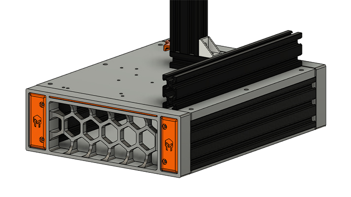

# Ender 2 Base Upgrade

[]

This repository is for my upgrades to the original Ender 2. This upgrade can use the existing main board or the BigTreeTech SKR Mini E3 v2 running either Marlin or Klipper. 

## Features
- Footprint is slightly larger making it a little more stable.
- The power supply is under the printer and fully enclosed.
- The new base plate is designed for both old and new main boards.
- Firmware: [Klipper](https://www.klipper3d.org/) (*recommended*), will also run [Marlin](https://marlinfw.org/)

### To Do List
As this is still a work in progress, there are several things still left to do:
- Reduce Part/Fastener Count (blind joints)
- Enclosure (maybe?)

## Build Tips
Print Settings are as follows:
- FDM Material: ABS recommended, but PETG will work too 
- Layer Height: 0.2mm
- Extrusion Width: 0.4mm
- Infill Percentage: 40% or more recommended
- Infill Type: Gyroid or Grid (others might work as well, experiment)
- Wall Count: 4
- Solid Top/Bottom Layers: 5
- Supports: All files designed to not require supports.

## BOM
#### Fasteners:
| Fastener | Qty | Where Used |
| :-------- | :---: | :---------- |
| M3x6 BHCS  | 8 | grill covers |
| M3x8 BHCS | 5 | grill fan, power supply fan extension |
| M3x8 FHCS | 2 | power outlet |
| M3x10 BHCS | 3 | main board cover posts |
| M3x12 BHCS | 2 | main board fan mount |
| M3x14 BHCS | 2 | power cable guard |
| M3x16 BHCS | 4 | main board |
| M3 Hex Nuts | 4 | main board fan mount, power cable guard |
| M3 T-Nuts | 3 | power supply |
| M3x5x4 Threaded Inserts | 14 | grills, grill fan, power outlet |
|   |   |   |
| M4x12 BHCS | 4 | bottom panel feet |
| M4 T-Nuts | 4 | bottom panel feet |
|   |   |   |
| M5x10 SHCS | 2 | power supply mounts |
| M5x14 BHCS | 6 | base plate extrusions |
| M5x16 SHCS | 12 | grills |
| M5 T-Nuts | 6 | base plate extrusions |

#### Parts:
| Item | Qty | Description | Source |
| :---- | :---: | :----------- | :------ |
| ABS Sheet 12"x12"x3/8" | 1 | route out new base plate | [Amazon](https://www.amazon.com/dp/B0CLY9Y116) |
| Cooling Fan Y Splitter | 1 | mod the power supply for two fans | [Amazon](https://www.amazon.com/dp/B0D4MFT6H9) |
| LC6015MS14 Fan 6015 14V | 1 | second fan for back grill | [Amazon](https://www.amazon.com/dp/B0DFH5X8SG) |
| Power Outlet  | 1 | back grill outlet | [Amazon](https://www.amazon.com/dp/B07RRY5MYZ) |
| Rubber Feet 18x15x11mm | 4 | bottom panel | [Amazon](https://www.amazon.com/gp/product/B07LCM3SBW) |
| Metal Extruder | 1 | replace the plastic extruder | [Amazon](https://www.amazon.com/Creality-Official-Extruder-3D-Aluminum/dp/B09LQKN5WG) |
| Part Cooling Fan | 1 | will need to tap the hotend cover for M2 | [Amazon](https://www.amazon.com/dp/B0C2VSJTYQ) |
| Hotend Silicone Sock | 1 | optional: helps with keeping things clean | [Amazon](https://www.amazon.com/Printer-Hotend-Silicone-Heater-Creality/dp/B09VKZJKQ2) |

## Contributers
If you would like to contribute to the development of this project, please let me know. I'm no professional engineer, so I could use all the help I can get.

## License & Copyright
The above information is provided under GNU GPLv3. More information can be found in the License file.\
Copyright © 2021 Armour Craft LLC\
